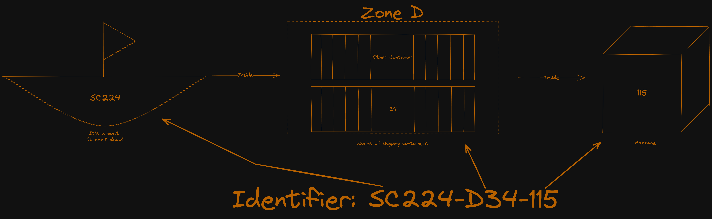

# Combination

**BE CAREFUL WHEN RUNNING `shipping_system_example.py` IT USES A LOT OF MEMORY AND MAY FREEZE YOUR COMPUTER**

To show how these systems might interact I have created `shipping_system_example.py`, which uses lookups, delimiters and cells!

The idea is to have a single string encoding that will help to help track shipments. 



For people who placed an order they will get a tracking number, this tracking number will correspond to an order. This tracking number will be a [UUID](https://en.wikipedia.org/wiki/Universally_unique_identifier) (unique ID, in our case UUID 4 like `b0bb789b-26a4-4d3a-b4b2-64639c92c8e7`), that is used mostly by the client to get the ETA. This number can be used by internal staff to access other information that clients cannot see, like where the package currently is.

From there internally for the package (not the order, since orders can contain multiple packages) there will be a `internal_location_identifier`, which is the schema we saw above in the image. So before the first dash is what you use to identify the vehicle the package is on, and then the remaining 2 groups tell you where on the vehicle the package is. For example `SC224-D34-115`, which can be broken up into 3 parts. If we break up the code according to the dashes (`-`) we get 3 groups `SC224`, `D34`,`115`, these groups correspond to:

| Group name | Description | Example |
|------------|-------------|---------|
| VEHICLE INDICATOR | The first two letters are vehicle type (`SC` for shipping cargo, `AC` for airplane cargo etc) and the next 1-3 digit number is the VID, or the vehicle ID to identify a specific vehicle | SC224, where `SC` means it's on a ship, and 224 is the vid for the ship |
| Zone Identifier | This indicates where on the vehicle the item is, and what container it's inside | D34, where D is the zone on the ship, and 34 is the container in that zone |
| Item Identifier | Where inside a container an item is | 115 is the item number inside the container, in the zone on the ship|

So for this package if we needed to find it physically we would tell someone to go to ship 224, inside zone D34 look for item 115.

## How useful is this

In our case when we run `shipping_system_example.py` let's compare 2 approaches to trying to find an item. The first is that we have a tracking number, and from that tracking number we search each ship, and each zone, and each container 1 by 1 to look for the item (since the tracking number has no info about the location of the package). 

If a ship is full it has 26 Zones ("A"-"Z") each with 35 containers (1-35) per zone and 120 items per container, so 109,200 items per ship. In our example order `b0bb789b-26a4-4d3a-b4b2-64639c92c8e7` is in ship 224, inside zone D, in container 34, item 115. If we consider each time we look up an object to count as 1, this means we would need to check:

```
total lookups = items before being found + 1

items before being found = Items before correct ship + Zones & items on correct ship
items before being found = (109,200 items * 223 ships) + ((4 zones) + (33 containers) + 114 items)
items before being found = (109,200 items * 223 ships) + ((4 zones* 35 containers/zone * 120 items/container) + (33 containers * 120  items/container) + 114 items)
items before being found = (24,351,600 items) + ((16,800 items) + (3,960 items) + 114 items)
items before being found = (24,351,600 items) + ((16,800 items) + (3,960 items) + 114 items)
items before being found = (24,351,600 items) + (20,874 items)
items before being found = (24,351,600 items) + (20,874 items)
items before being found = 24,372,474 items

total lookups = 24,372,474 items + correct item
total lookups = 24,372,474 items + 1
total lookups = 24,372,475 items
```

So at best we would need to check 24,372,475 items with this simple approach. So we will say we have to make 24,372,475 lookups, though this undercounts our total lookups because in python we would also have to lookup each ship, and each container etc. There are ways of speeding up random checks like this, but they are much more complicated. Instead we can use the path encoding from earlier to make this much faster.

If we use something like an internal identifier to look up an item we know which ship, so we can look that up, we know which zone, which container, and which item in the container to check. So for lookups we have:

```
total lookups = ship lookups + container lookups + item within container lookup
total lookups = (1) + (2) + (1)
total lookups = 4
```

4 total lookups. The actual code for this would look something like this:

```python
package_ship = Ship.ships[ship_id-1]
package_zone = package_ship.zones[zone_letter]
package_container = [zone_number-1]
item = package_container.items[item_number]
```

So the full process to get an order from a tracking number is:

```python
order = Order.orders[tracking_number]
```

From there if you know which item you want it will give you the internal identifier, which can use the 4 steps above. So total would be 5 lookups to get the item you're looking for. More than a %99.9 reduction in lookups.

## Time estimates

To get an accurate time estimate we will use the ETA of the vehicle the package is currently on. So you can use the tracking ID to find the package, from there you can make sure the time estimate is up to date by having it check the ship it's on and check the ships time estimate to make sure they're the same. That way you only have to update the ship's time estimate to make sure all the packages are correct when people try to access them!


