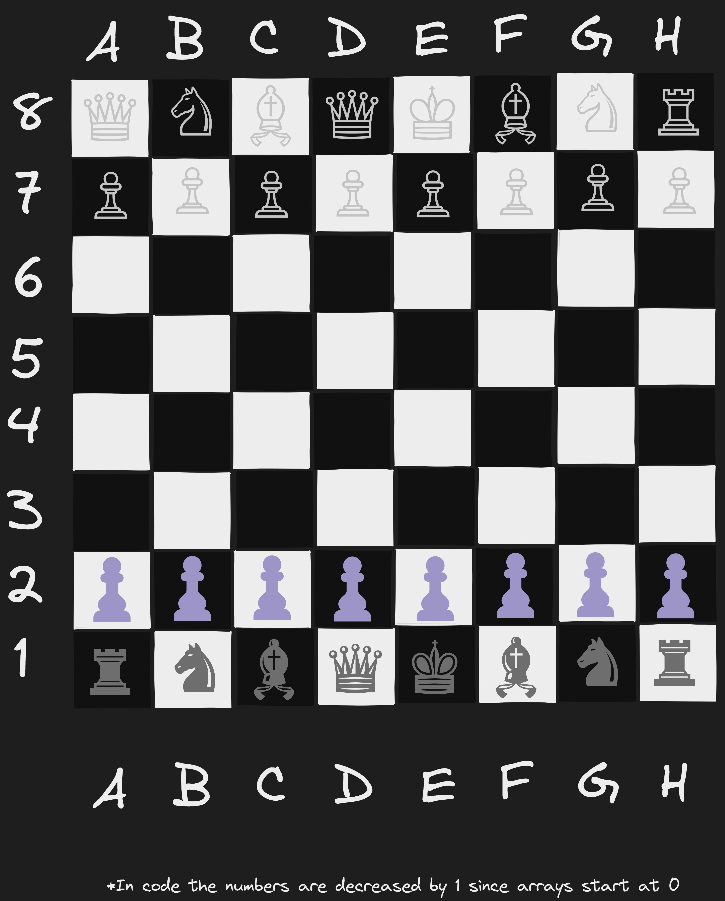
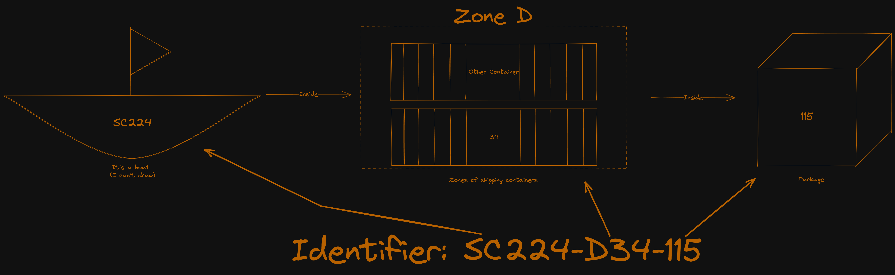

# Power of paths

This repository is meant to accompany the [power of paths post](https://schulichignite.com/blog/the-power-of-paths) on the [schulich ignite blog](https://schulichignite.com/blog). Essentially it's here to show off different path encodings. The repo is implemented in python and spread across the different encoding techniques discussed. 

If you are unfamiliar with any of the below it's recommended to look into them before looking at the code: 

- [Type hints in python](https://canadiancoding.ca/Type%20Hinting%20&%20Checking)
- [Dataclasses in python](https://canadiancoding.ca/Dataclasses)

## Table of contents

- [Cell-based encoding](#cell-based-encoding)
  - [Chess](#chess)
  - [Spreasheets](#spreasheets)
  - [Tic-tac-toe](#tic-tac-toe)
- [Delimiters](#delimiters)
- [Lookups](#lookups)
- [LR Format](#lr-format)
- [Combination](#combination)

## Cell-based encoding

[Cell based encoding](https://schulichignite.com/blog/the-power-of-paths/#cells) is useful for applications where your data is easily structured. Lots of game systems ([chess](https://www.chess.com/terms/chess-notation), battleship, [minesweeper](https://rosettacode.org/wiki/Minesweeper_game#Python) etc.), physics calculations & graphs ([Cartesian coordinates](https://en.wikipedia.org/wiki/Cartesian_coordinate_system#Three_dimensions:~:text=of%20a%20number.-,Three%20dimensions,-%5Bedit%5D)), and even spreadsheets ([A1 or R1C1 Notation](https://bettersolutions.com/excel/formulas/cell-references-a1-r1c1-notation.htm#:~:text=To%20refer%20to%20a%20cell,letter%20and%20a%20row%20number.)).

In our case we have implemented 3 systems to show off how cell-based encoding works:

### Chess

`chess.py`: An implementation of a chess board and pieces using standard [chess notation](https://www.chess.com/terms/chess-notation). So in this case the white king (`♔` or `K`) would be at `E8`, so `♔E8` or `KE8` would be valid:

### Spreasheets

`spreadsheet.py`: Is an implementation of a standard spreadsheet system (like excel), which gives you access to create cells and assign them to set columns and rows.

### Tic-tac-toe

`tic-tac-toe.py`:Tic-tac-toe is a game where you have two players (X and O), a player wins when 3 of their characters form a line. We can represent each move by using a letter for the column and a number for a row. So in the image below we can say X's moves were `A1 B2 C3`

## Delimiters

...

## Lookups

Lookups are used to give each item in your search space a unique ID, from this you can directly find a resource. A great example of this is [dictionaries in python](https://realpython.com/python-dicts/). There are tons of ways to use lookups, but the example in `lookup-users.py` is using lookups to locate a specific user based on their email!

## LR Format

In the article we defined a [custom LR encoding](https://schulichignite.com/blog/the-power-of-paths/#custom-left-right-format) for mazes. Essentially you include an L or an R for each turn of a maze until completion:

Maze with solution string

Maze after solution string is used to solve maze

The python file just stores the data in a maze object and can be found at `maze.py`

## Combination

To show how these systems might interact I have created `shipping-system.py`, which uses lookups, delimiters and cells!

